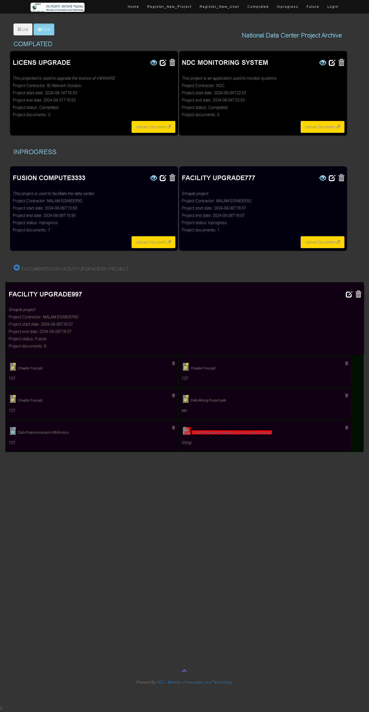
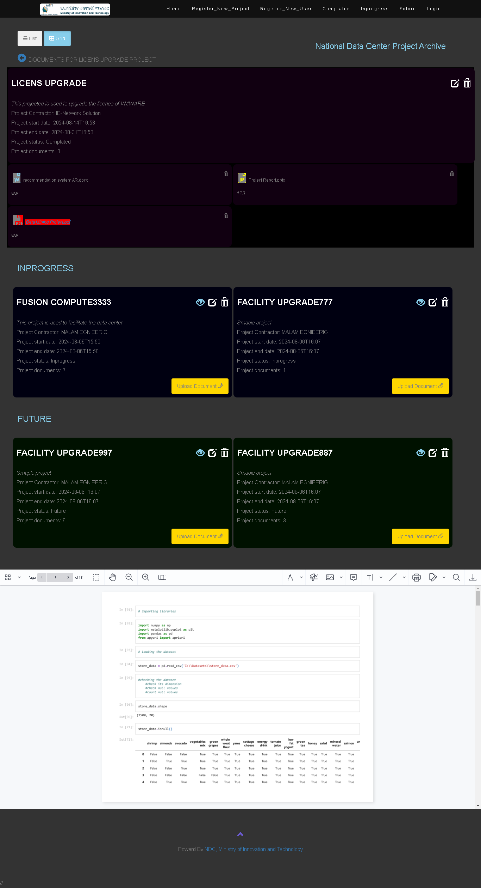

# National Data Ceter Project Document Storage and Retrieval System

A web application built with Laravel, a PHP framework for web artisans.

## Table of Contents

- [Introduction](#introduction)
- [Features](#features)
- [Installation](#installation)
- [Usage](#usage)
- [Preview](#Preview)

## Introduction

This project is a Laravel-based web application designed to manage and store various types of project records and documents. It scalable and maintainable web applications.

## Features

- User authentication and authorization
- Document upload and management
- Register new project
- Register new user
- Track comlated projects
- Track inprogress projects
- Track future projects
- Responsive design with Bootstrap

## Preview

Sample screen shoot with a file opened


## Installation

To set up the project locally, follow these steps:

1. **Clone the repository:**

    ```bash
    git clone https://github.com/your-username/your-laravel-repository.git
    ```

2. **Navigate to the project directory:**

    ```bash
    cd your-laravel-repository
    ```

3. **Install the dependencies:**

    ```bash
    composer install
    ```

4. **Copy the `.env.example` file to `.env` and configure it:**

    ```bash
    cp .env.example .env
    ```

5. **Generate an application key:**

    ```bash
    php artisan key:generate
    ```

6. **Run database migrations:**

    ```bash
    php artisan migrate
    ```

## Usage

To start the development server, run:

```bash
php artisan serve
